# Multi-Field Hex Automaton

Three coupled fields on a hexagonal torus — **density**, **energy**, and **momentum** — with leakage and coupling that grow into self-sustaining patterns.

<p align="center">
  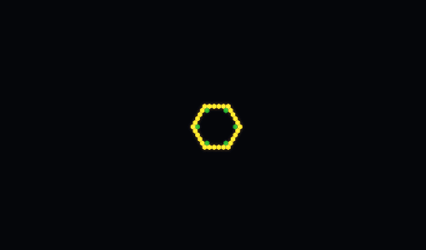
  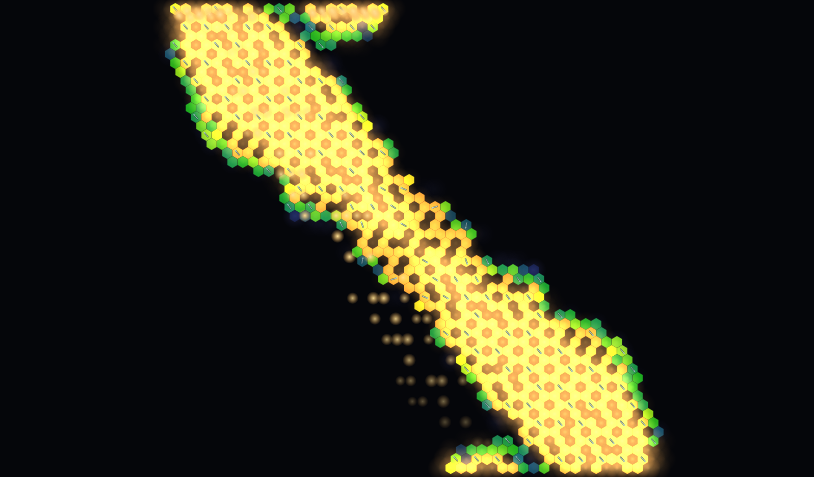
</p>
<p align="center"><sub><b>Resonant Bloom</b> — ring seed (left, GIF) to a high-resonance front at generation 520 (right). Still expanding; resonance 0.94.</sub></p>

v2 layers density, energy glow, momentum arrows, and leak particles, and replaces raw engine knobs with two sliders (**Survival Pressure**, **Momentum Bias**). A 13-preset library was found by sweeping those axes. v3 adds a 3D viewer: each field as its own stacked layer, linked by beams that track per-cell production, reinforcement, and leak. v4 adds a **Rule Set Formula** view (the live rule set as real numbers, not just a param name), a **rule kit export/import** (JSON — share the ruleset alone, or with exact canvas state to resume mid-growth), and a full glossary of what every attribute actually does.

Also in the repo, unrelated to the field engine but sharing its hex-grid math: **[Langton's Arm](langtons-arm.html)**, a hex-generalized Langton's Ant. Rule LR turns out *not* to build the classic highway on this grid — instead it grows a mirror-symmetric fractal shell pattern, stable out to 10M+ steps. A follow-up sweep tried to evoke that character in the field engine itself; genuine nested rings never emerged, but the attempt produced **Coral Echo** (preset #14) — Resonant Bloom's exact rules, point-seeded into a compact branching fractal instead. See [`docs/LANGTONS_ARM.md`](docs/LANGTONS_ARM.md) for the full, honest writeup of what was tried and what didn't work.

**Live:** [2D explorer](https://karx.github.io/hex-automaton-explore/) · [3D viewer](https://karx.github.io/hex-automaton-explore/viewer3d.html) · [Langton's Arm](https://karx.github.io/hex-automaton-explore/langtons-arm.html)

**Run it locally:** [`index.html`](index.html) (2D) · [`viewer3d.html`](viewer3d.html) (3D) · [`langtons-arm.html`](langtons-arm.html) — needs a static server, see [Quick start](#quick-start).

**Write-ups:** [`docs/VARIANT_REPORT.md`](docs/VARIANT_REPORT.md) (v1 engine + original 8 variants) · [`docs/VISUALIZATION_STYLE_GUIDE.md`](docs/VISUALIZATION_STYLE_GUIDE.md) (v2 visual language, ontology, presets, 3D) · [`docs/ATTRIBUTE_GLOSSARY.md`](docs/ATTRIBUTE_GLOSSARY.md) (v4 — what every parameter and slider means, mental model) · [`docs/LANGTONS_ARM.md`](docs/LANGTONS_ARM.md) (hex Langton's Ant findings)

## Showcase

Developed stills of the six GIF showcases. Click a name to watch it grow (`gifs-v2/`).

<table>
  <tr>
    <td align="center" width="50%">
      <a href="gifs-v2/resonant-bloom.gif"></a><br>
      <b><a href="gifs-v2/resonant-bloom.gif">Resonant Bloom</a></b><br>
      <sub>Flagship discovery. Still growing at gen 1000; resonance 0.8–1.0.</sub>
    </td>
    <td align="center" width="50%">
      <a href="gifs-v2/pulsing-heart.gif">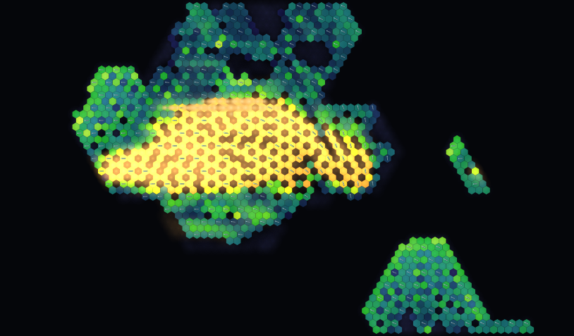</a><br>
      <b><a href="gifs-v2/pulsing-heart.gif">Pulsing Heart</a></b><br>
      <sub>Crash-and-regrow cycle. Energy dumps, then the field climbs again.</sub>
    </td>
  </tr>
  <tr>
    <td align="center">
      <a href="gifs-v2/drifting-vortex.gif">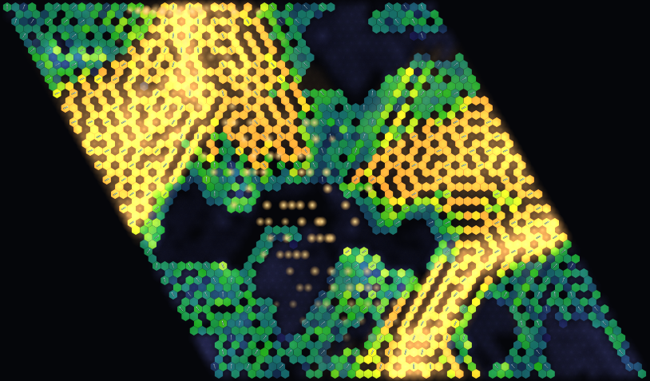</a><br>
      <b><a href="gifs-v2/drifting-vortex.gif">Drifting Vortex</a></b><br>
      <sub>Highest leak rate, off-center seed. Growth pulls and rotates.</sub>
    </td>
    <td align="center">
      <a href="gifs-v2/ember-bloom.gif">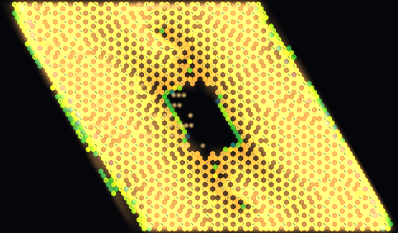</a><br>
      <b><a href="gifs-v2/ember-bloom.gif">Ember Bloom</a></b><br>
      <sub>Same rules as Sparse Ember; isotropic leak flips it to a 63% bloom.</sub>
    </td>
  </tr>
  <tr>
    <td align="center">
      <a href="gifs-v2/stable-crystal.gif">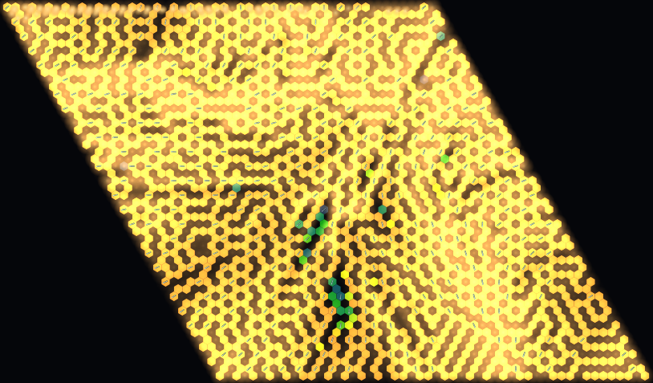</a><br>
      <b><a href="gifs-v2/stable-crystal.gif">Stable Crystal</a></b><br>
      <sub>Overshoots, then locks a ~58% lattice. Calmest preset in the library.</sub>
    </td>
    <td align="center">
      <a href="gifs-v2/charged-current.gif">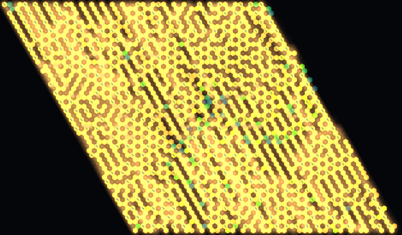</a><br>
      <b><a href="gifs-v2/charged-current.gif">Charged Current</a></b><br>
      <sub>Storm Field tamed by directional bias into a settled current.</sub>
    </td>
  </tr>
</table>

## Visual language

Each field is its own layer. Toggle them independently in the explorer.

<table>
  <tr>
    <td align="center" width="33%">
      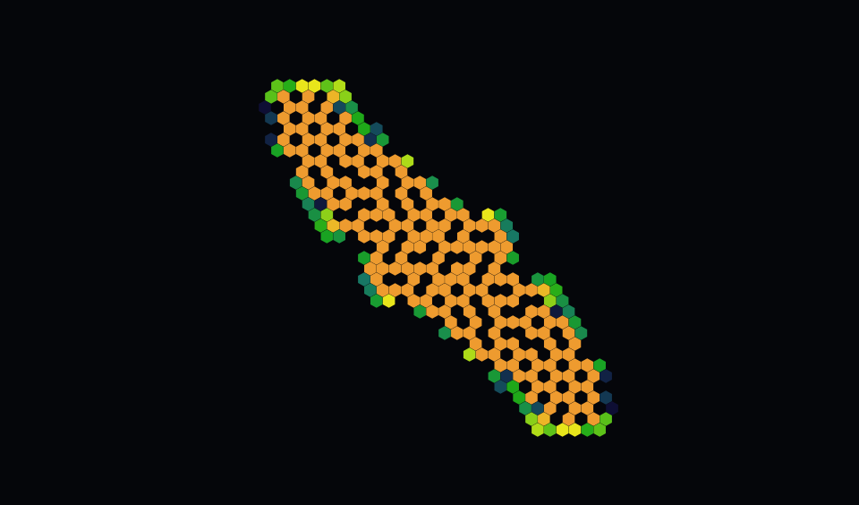<br>
      <sub><b>Density</b> — filled hexes, indigo → amber</sub>
    </td>
    <td align="center" width="33%">
      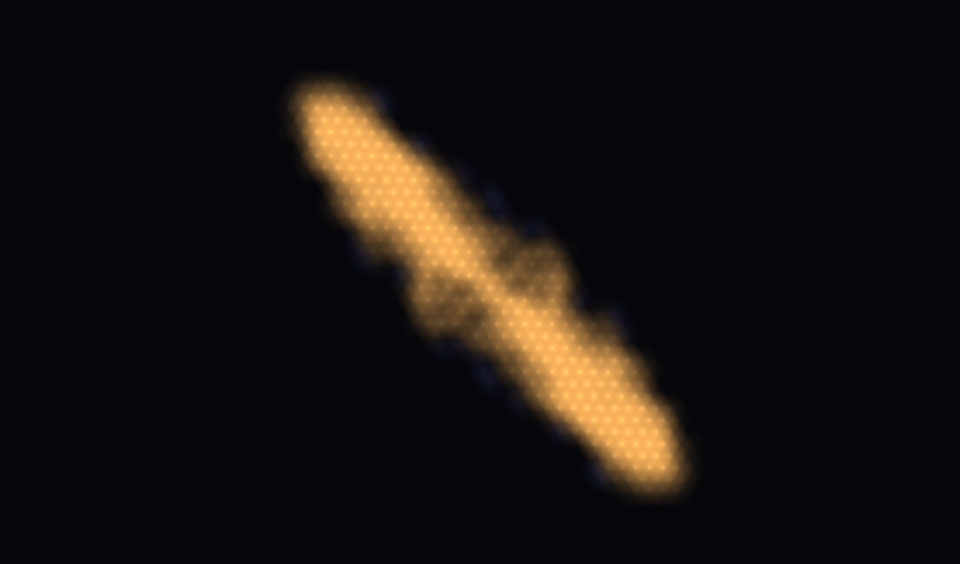<br>
      <sub><b>Energy</b> — additive glow (warm / violet)</sub>
    </td>
    <td align="center" width="33%">
      <br>
      <sub><b>Momentum</b> — flow-field arrows</sub>
    </td>
  </tr>
</table>

<p align="center">
  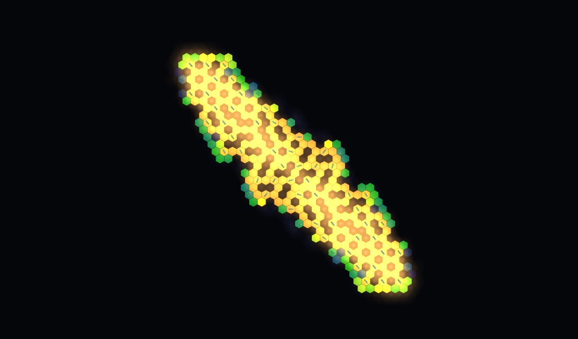<br>
  <sub>All three layers together, plus leak particles in the live demo.</sub>
</p>

<p align="center">
  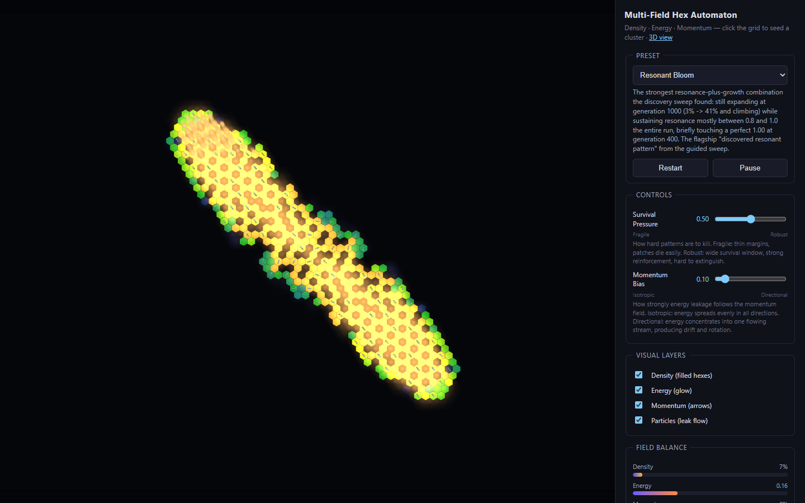<br>
  <sub>2D explorer — presets, Survival Pressure / Momentum Bias, live field meters, resonance badge.</sub>
</p>

The 3D viewer (`viewer3d.html`) stacks those same fields in space and draws interaction beams from the engine's per-cell production, reinforcement, and leak magnitudes. Same presets and sliders as 2D.

## CI

Push and pull request both run `npm test` (rule-kit round-trip, Langton/Coral Echo checks, all 14 presets, v1 variant regression). A passing test job on `master` deploys the static site to GitHub Pages. Set **Settings → Pages → Source: GitHub Actions** once.

```bash
npm test
```

## Quick start

The demo uses ES modules (and, for the 3D viewer, an import map), so it needs a static file server — not `file://`:

```bash
npm install
npx serve .          # or: python -m http.server
```

Open the printed URL for **`index.html`** (2D) or **`viewer3d.html`** (3D) — each links to the other. Both share the same simulation engine, presets, and ontology sliders.

**2D:** pick a preset (sliders jump to its authored position); click the grid to drop seed clusters. Ontology sliders and the four visual-layer checkboxes update live. Raw engine parameters are under Advanced, each with a hover tooltip explaining what it does. "Rule set formula" prints the live rule set as real numbers. "Export rule kit" / "Import rule kit" share or resume it.

**3D:** density as extruded hex height, energy as glowing orbs, momentum as oriented arrows. Drag to orbit, scroll to zoom, toggle any layer or the beams. Export/import rule kits here too. No raw-parameter panel or formula view here — use 2D for that.

## How it works

- **Grid:** axial `(q, r)` hex torus — both axes wrap, so there are no edge deaths.
- **Density** (0–1): material. Birth/survival windows on neighbor density, widened by local energy.
- **Energy:** produced by dense clusters, spent on activity, leaked along momentum, plus a flat decay.
- **Momentum:** unit vector. New cells inherit a density-weighted average of their neighbors; leak follows this direction.
- **Ontology:** Survival Pressure and Momentum Bias compose onto a preset's archetype params (`src/ontology.js`). There is no hidden state a slider cannot reach.

Full explanation of every parameter — what it means, what turning it up or
down actually does — is in [`docs/ATTRIBUTE_GLOSSARY.md`](docs/ATTRIBUTE_GLOSSARY.md).

## Sharing and resuming a rule set

Every rule set can be exported as a portable JSON **rule kit**
(`src/ruleKit.js`) — from either the 2D or 3D view:

- **Rules only** (a few KB): the complete, resolved parameter set — a
  portable version of "this preset at these slider positions," valid even if
  the sender hand-tuned raw parameters beyond what the sliders reach.
- **Rules + canvas state** (checkbox, scales with grid size): also captures
  every cell's density/energy/momentum and the current generation, so
  loading it resumes the *exact* simulation, not just the rules — verified
  bit-identical in `scripts/verify-rulekit.mjs`.

Import accepts a pasted-in `.json` file or a direct file upload. The **Rule
set formula** panel (2D view) shows the same rule set as a human-readable
formula sheet — grouped birth/survival/energy/momentum equations with your
current numbers substituted in, not a raw parameter dump.

## Preset library

The first eight are the original v1 variants at neutral sliders `(0.5, 0.5)`. The next five were found by `scripts/discover.mjs` and verified to 1000 generations. The last was found by `scripts/discover-shell.mjs`, a sweep aimed at evoking Langton's Arm's fractal character (see [`docs/LANGTONS_ARM.md`](docs/LANGTONS_ARM.md)).

| Preset | Archetype | P / B | Character |
|---|---|---|---|
| Stable Crystal | crystal-bloom | 0.5 / 0.5 | Fast overshoot, then a 58% plateau |
| Coral Reef | dense-coral | 0.5 / 0.5 | Slow burn, 67% overshoot, dynamic edges |
| Drifting Vortex | vortex-drift | 0.5 / 0.5 | Rotating, momentum-biased growth |
| Storm Field | storm-field | 0.5 / 0.5 | Turbulent, patches die and reignite |
| Pulsing Heart | pulsar | 0.5 / 0.5 | Crash-and-regrow heartbeat |
| Sparse Ember | ember-ring | 0.5 / 0.5 | Small glowing clusters, mostly dark |
| Spreading Front | spreading-front-ring | 0.5 / 0.5 | Textbook outward wavefront |
| Fault Line | fault-line | 0.5 / 0.5 | Line nearly dies, then fragments recover |
| Resonant Vortex | vortex-drift | 0.6 / 0.7 | 58% plateau, resonance climbs to 0.90 |
| Charged Current | storm-field | 0.6 / 0.9 | Storm tamed into a directed current |
| Resonant Bloom | spreading-front-ring | 0.5 / 0.1 | Still growing at gen 1000, resonance ~1 |
| Ember Bloom | ember-ring | 0.5 / 0.1 | Sparse ember flipped into a 63% bloom |
| Pulse Current | storm-field | 0.5 / 0.9 | Uneven surges, resonance spikes to 0.99 |
| Coral Echo | spreading-front-ring | 0.5 / 0.1 | Resonant Bloom's rules, point-seeded — compact branching fractal, not a ring |

## v1 — flat renderer

The original eight variants, single-color hexes, captured as GIFs in [`gifs/`](gifs/). Full numbers and rule notes are in the [variant report](docs/VARIANT_REPORT.md).

| Variant | Seed | Character | GIF |
|---|---|---|---|
| Crystal Bloom | cluster | stable plateau | [gif](gifs/crystal-bloom.gif) |
| Dense Coral | cluster | overshoot → equilibrium | [gif](gifs/dense-coral.gif) |
| Vortex Drift | asymmetric | drifting, momentum-biased | [gif](gifs/vortex-drift.gif) |
| Storm Field | cluster | turbulent, still climbing | [gif](gifs/storm-field.gif) |
| Pulsar | asymmetric | crash-and-regrow | [gif](gifs/pulsar.gif) |
| Ember Ring | ring | sparse, slow glow | [gif](gifs/ember-ring.gif) |
| Spreading Front (Ring) | ring | textbook growing front | [gif](gifs/spreading-front-ring.gif) |
| Fault Line | line | near-death, then recovers | [gif](gifs/fault-line.gif) |

## Regenerating GIFs, stills, and sweeps

```bash
# v1 (raw-parameter sweep, original 8 variants)
node scripts/sweep.mjs                 # headless param sweep -> scripts/sweep-results.json
node scripts/verify.mjs                # 1500-gen stability check on top sweep candidates
node scripts/verify-line.mjs           # line/single-cell seed checks
node scripts/generate-gifs.mjs         # renders all 8 variants -> gifs/*.gif + gifs/summary.json

# v2 (ontology-guided discovery sweep, 14-preset library)
node scripts/regress-presets.mjs       # confirm v1 variants still survive after the engine change
node scripts/discover.mjs              # sweep Survival Pressure x Momentum Bias x archetypes
node scripts/verify-discoveries.mjs    # 1000-gen stability check on discovery-sweep winners
node scripts/discover-shell.mjs        # sweep aimed at Langton's-Arm-style shell/lace character
node scripts/verify-presets.mjs        # confirm all 14 presets.js entries survive end-to-end
node scripts/generate-gifs-v2.mjs      # renders showcase presets with full v2 layers -> gifs-v2/

# README stills (late-generation PNGs — GIFs start at gen 0, which is a tiny seed)
node scripts/render-readme-shots.mjs   # -> docs/shots/2d-*.png and layer-*.png

# UI screenshots (needs a static server + Playwright Chromium)
npx playwright install chromium
npx serve -l 4176 .
node scripts/capture-readme-ui.mjs     # -> docs/shots/ui-*.png

# v3 (3D viewer regression check — needs a static server on :4175 first)
npx serve -l 4175 .
node scripts/smoke-test-3d.mjs         # headless Chromium + software-GL

# v4 (rule kit export/import)
node scripts/verify-rulekit.mjs        # headless round-trip: export -> parse -> resume -> step, bit-identical
npx serve -l 4177 .                    # then, for the browser UI path:
node scripts/smoke-test-rulekit.mjs    # export/import/formula on both index.html and viewer3d.html

# Langton's Arm (hex Langton's Ant)
node scripts/verify-langtons-arm.mjs   # parseRule, determinism, no-highway, Coral Echo identity
node scripts/analyze-langtons-arm.mjs  # long-run displacement analysis (highway detection)
node scripts/render-langtons-arm.mjs   # snapshot PNGs at increasing step counts -> scripts/
npx serve -l 4178 .
node scripts/smoke-test-langtons-arm.mjs
```

## Layout

```
src/engine.js            CA engine: hex grid, fields, rules, leak-direction softmax,
                         per-cell interaction fields, lastStats
src/ontology.js          Survival Pressure / Momentum Bias -> raw param transforms
src/presets.js           the 14-preset library
src/variants.js          the original 8 v1 variants (raw params)
src/render.js            layered 2D hex rendering
src/particles.js         leak-flow particle system (2D)
src/flowDiagram.js       animated interaction-flow diagram (2D)
src/seeds.js             seed placement helpers
src/three/hexGeometry.js hex prism / arrow / energy-orb geometry
src/three/viewer3d.js    3D stacked InstancedMesh layers + interaction beams
src/paramMeta.js         per-parameter meaning/effect metadata (glossary + tooltip source)
src/formula.js           live rule set -> human-readable formula text
src/ruleKit.js           rule kit export/import (params + optional canvas state)
src/langtonsAnt.js       hex-generalized Langton's Ant (sparse infinite grid; unrelated to Engine)
src/langtonsAntRender.js auto-fitting canvas rendering for the ant's growing pattern
index.html               interactive 2D browser demo
viewer3d.html            interactive 3D browser demo
langtons-arm.html        interactive Langton's Arm demo
scripts/                 sweep, discovery, verification, GIF + still capture
gifs/                    v1 GIFs (one per original variant)
gifs-v2/                 v2 GIFs (layered rendering, showcase presets)
docs/shots/              README stills, layer breakdown, UI screenshots
docs/VARIANT_REPORT.md   v1 write-up
docs/VISUALIZATION_STYLE_GUIDE.md    v2 + v3 write-up
docs/ATTRIBUTE_GLOSSARY.md           v4 write-up — every parameter + ontology slider, explained
docs/LANGTONS_ARM.md                 hex Langton's Ant findings (no highway, fractal shell instead)
```
