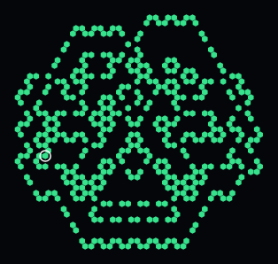
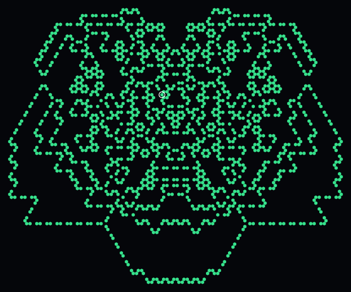

# Langton's Arm — Hex-Generalized Langton's Ant

Added 2026-08-16. A single discrete walker automaton, unrelated to the
density/energy/momentum field engine used everywhere else in this project —
included here because it shares the project's hex-grid conventions
(`src/engine.js`'s `DIRS`/`axialToPixel`) and because the field-preset
request that followed it (see bottom of this doc) was directly inspired by
what it produces.

- **Engine:** `src/langtonsAnt.js`
- **Rendering:** `src/langtonsAntRender.js` (auto-fits the growing pattern to the canvas each frame)
- **Interactive page:** `langtons-arm.html`
- **Analysis:** `scripts/analyze-langtons-arm.mjs`, `scripts/render-langtons-arm.mjs`

## The rule

Classic Langton's Ant: a single "ant" sits on a cell, reads that cell's
state, turns according to a rule string (one L/R character per state), flips
the cell to the next state, and steps forward. On a square grid there are 4
headings and 90° turns; here there are the same 6 hex headings
`src/engine.js` already uses elsewhere, so a turn is a 60° step, `+1` index
for Right and `-1` for Left (verified: `DIRS` is strictly rotational, exactly
60° apart per entry).

The rule string generalizes past 2 states — `"LR"` is the original 2-state
ant, `"RRLL"` is a 4-state variant, etc. State 0 is implicit (never stored)
so the grid can be sparse.

**The grid is a sparse, logically infinite plane** (a `Map` keyed by cell
coordinate), not this project's usual fixed toroidal array. This was a
deliberate choice, not the default: Langton's Ant is famous for eventually
walking a "highway" that can travel thousands of cells from its start; a
fixed-size wrapped grid would let that highway wrap around and collide with
its own trail, corrupting exactly the long-run behavior worth observing.

## Finding: rule LR does not build a highway on this grid

The square-grid version of rule LR is famous for ~10,000 steps of chaotic
growth before locking into a diagonal highway (unbounded, steady directional
drift) — one of the most-cited emergent-order results in cellular automata.
**The hex version does not do this.** Measured directly, not assumed:

```
node scripts/analyze-langtons-arm.mjs
```

Over 2,000,000 steps, the ant's displacement from its origin oscillates
between roughly 0 and 130 cells with no sustained trend — the average
displacement *rate* over the final samples is 0.0002 cells/step, indistinguishable
from noise. A separate 10,000,000-step run (`node -e "..."`, see git history
of this doc's authoring session) confirms this is stable, not a slow
transient: displacement was still just 134.8 cells from origin, while the
bounding box had grown to 703×559 and the visited-cell count to 24,000 —
i.e. the *pattern* keeps growing and getting more intricate, but the *ant*
keeps returning toward its starting region rather than escaping.

Rules `RL`, `LLRR`, and `LRRL` were spot-checked too (200k steps each,
`scripts/analyze-langtons-arm.mjs`) — same story, no directional escape in
that window.

## What it looks like instead

Rendered snapshots (`scripts/render-langtons-arm.mjs`) at increasing step
counts show something more interesting than "no highway": a **mirror-symmetric,
fractal, shell-like growth pattern** — nested outline "shells" expanding
outward from the center, densely fractal/lace-like fill inside, and the
bilateral (mirror) symmetry holding all the way out to at least a million
steps.

<p align="center">
  
  
</p>
<p align="center"><sub>Rule LR at 10,000 steps (left) and 100,000 steps (right). The mirror symmetry is exact, not approximate — a consequence of the fixed start heading breaking the hex grid's 6-fold symmetry down to one reflection axis.</sub></p>

The symmetry isn't a coincidence of these particular snapshots: the ant
starts with a fixed heading (index 0, i.e. pointing along one of the hex
grid's six axes), which breaks the grid's full 6-fold rotational symmetry
down to exactly one mirror line through that axis. Every step the ant takes
on one side of that line has a mirrored counterpart on the other, and the
rule is deterministic, so the symmetry is exact and self-sustaining rather
than approximate.

## Using the interactive page

`langtons-arm.html` — rule string input (validated, clear error on invalid
characters), Play/Pause, single-step, a log-scale "steps per frame" slider
for fast-forwarding, and Jump-to buttons at the step counts above (1K
through 5M) so you don't have to sit through the intermediate frames to see
the milestones. Stats panel shows live displacement, so you can watch
directly whether a given rule is escaping (climbing) or bounded (oscillating)
— exactly the distinction the analysis above is built on.

## Field-engine echo: what the other automaton's mechanics actually produce

After seeing the shell/fractal pattern above, the natural follow-up was:
could the *unrelated* density/energy/momentum field engine (`src/engine.js`)
be tuned to evoke a similar visual character — expanding shells, lacy
fractal detail, bilateral symmetry — using its own, completely different
mechanics? This automaton literally cannot be "simulated" by the field
engine (a single discrete walker vs. a parallel continuous-field update rule
share no mechanism), so the question was always about evocation, not
reproduction — and the honest answer, found via `scripts/discover-shell.mjs`
plus direct visual inspection of every candidate, is **mixed**.

**What was tried:** a custom guided sweep scored candidates on concentric-ring
structure (a radial density-profile peak-counter) and lacy texture (edge
complexity), across the archetypes most likely to produce selective,
non-solid growth (Ember Ring, Spreading Front, Storm Field, Crystal Bloom,
Fault Line), all seeded from a small point cluster instead of their usual
ring/asymmetric seeds — the fairest test of whether *rings* emerge, since
seeding a ring seed makes the ring-ness a foregone conclusion.

**What actually happened, checked by rendering every top-scoring candidate,
not just trusting the score** (the automated metric was initially fooled by
a maze-textured filled blob into a high "ring peak" count — visual
inspection matters, not just numbers):

- Point-seeded growth from these archetypes does **not** form nested,
  widely-spaced concentric shells with empty space between them. It forms
  either a solid filled mass with fine internal maze/Turing-pattern veining
  (once it's grown large enough to self-interfere on the toroidal grid), or,
  at smaller scale / earlier generations, a compact **organic, coral-like
  branching form** radiating from the seed point.
- A boom-bust preset (Pulsar) seeded from a point fragmented into multiple
  drifting islands, each with a genuine two-tone structure (dense maze core
  + softer energy-glow halo) — an interesting two-layer effect, but not
  multiple concentric rings.
- Pushing survival pressure low enough to force the interior to die back
  (hoping for a hollow ring) just kills the whole pattern outright — this
  engine's fragile/robust axis is a near-cliff below its neutral point (see
  `docs/ATTRIBUTE_GLOSSARY.md`), not a dial that can carve out a stable hollow.

**Conclusion:** this engine's local-diffusion mechanics don't have a
wavelength-selecting term the way a reaction-diffusion "target pattern"
system would, so genuine nested rings aren't in its reachable behavior
space — at least not from anything tried here. What *is* genuinely there,
and genuinely evocative of Langton's Arm's fractal branching character (if
not its ring geometry), is the **Coral Echo** preset: the exact same rules
and ontology-slider position as Resonant Bloom, with the seed changed from a
ring to a small point cluster. That one change is enough to produce a
compact, radially-branching fractal form with visible internal veining for
its first several hundred generations, before it grows large enough to
self-interfere and thicken into a filled mass like the project's other
wavefront presets — so its most striking phase is early-to-mid growth, not
its long-run steady state.
